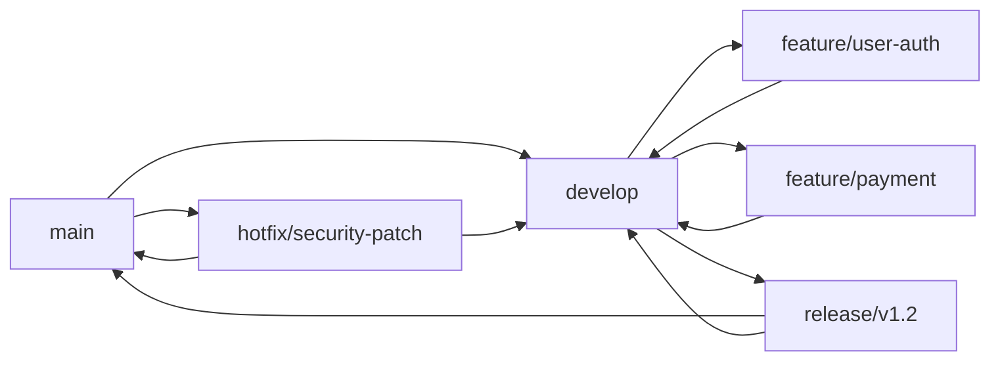
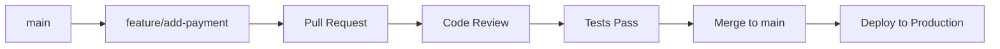
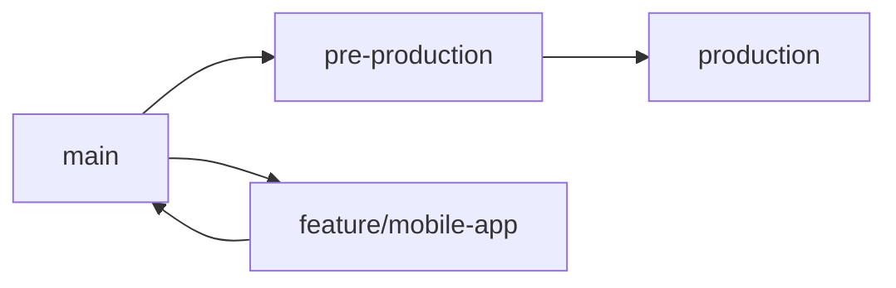
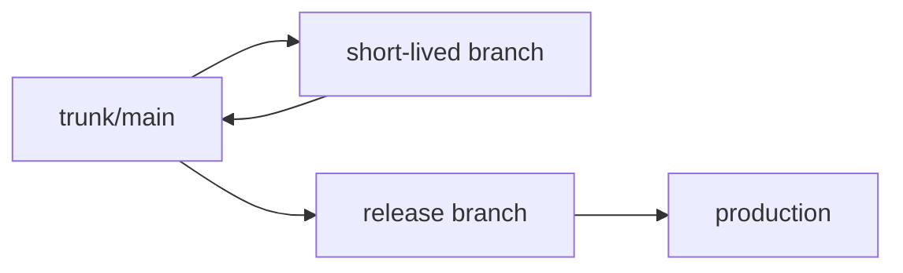
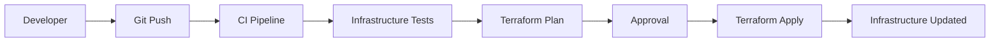

# 🌐 Git et Version Control Avancé
## Stratégies de Branching et Workflows DevOps

---

## 🎯 **Git pour DevOps - Concepts Avancés**

### **Pourquoi Git est Critical pour DevOps ?**
- **Source of Truth** : Code, Infrastructure, Configuration
- **Collaboration** : Équipes distribuées, reviews, merge
- **Traceability** : Historique complet des changements
- **Automation Trigger** : Webhooks pour CI/CD
- **Rollback Capability** : Retour à un état stable
- **Branch Strategy** : Gestion des environnements

### **Git vs Autres VCS**
```yaml
Git (Distributed):
  ✅ Offline capability
  ✅ Fast branching/merging  
  ✅ Complete history locally
  ✅ Flexible workflows
  ✅ Industry standard

SVN (Centralized):
  ❌ Single point of failure
  ❌ Slower operations
  ❌ Limited offline work
  ❌ Complex branching
```

---

## 🌿 **Stratégies de Branching**

### **1. GitFlow (Traditional)**



**Structure :**
- **main** : Production-ready code
- **develop** : Integration branch
- **feature/** : Nouvelles fonctionnalités  
- **release/** : Préparation des releases
- **hotfix/** : Corrections urgentes

**Workflow :**
```bash
# Créer une feature branch
git checkout develop
git checkout -b feature/user-authentication

# Développement...
git add .
git commit -m "Add user login functionality"

# Merge vers develop
git checkout develop
git merge feature/user-authentication
git branch -d feature/user-authentication

# Créer une release
git checkout -b release/v1.2.0
# Bug fixes dans la release...
git checkout main
git merge release/v1.2.0
git checkout develop  
git merge release/v1.2.0
git tag v1.2.0
```

**Avantages :**
✅ Structure claire et prévisible
✅ Séparation environnements (dev/staging/prod)
✅ Support releases parallèles
✅ Hotfix process bien défini

**Inconvénients :**
❌ Complexe pour équipes petites
❌ Merge conflicts fréquents
❌ Lent pour déploiements fréquents
❌ Overhead pour CI/CD moderne

### **2. GitHub Flow (Simple)**



**Workflow :**
```bash
# Créer feature branch depuis main
git checkout main
git pull origin main
git checkout -b feature/add-payment-gateway

# Développement et commits
git add .
git commit -m "Implement Stripe payment integration"
git push origin feature/add-payment-gateway

# Pull Request → Code Review → Merge → Deploy
```

**Règles :**
1. **main** est toujours deployable
2. Créer des branches descriptives depuis main
3. Push régulièrement vers origin
4. Ouvrir PR dès que possible (draft)
5. Deploy immédiatement après merge

**Avantages :**
✅ Simple et rapide
✅ Idéal pour déploiement continu
✅ Moins de merge conflicts
✅ Focus sur le code review

**Inconvénients :**
❌ Pas de staging branch
❌ Difficile avec releases planifiées
❌ Moins de contrôle qualité

### **3. GitLab Flow (Hybrid)**



**Environment Branches :**
- **main** : Latest stable code
- **pre-production** : Staging environment
- **production** : Production environment

**Workflow :**
```bash
# Feature development
git checkout main
git checkout -b feature/mobile-app
# Development...
git checkout main
git merge feature/mobile-app

# Deploy to staging
git checkout pre-production
git merge main

# Deploy to production (after validation)
git checkout production
git merge pre-production
```

### **4. Trunk-Based Development**



**Principes :**
- Tous les développeurs commitent sur trunk/main
- Branches de feature très courtes (< 2 jours)
- Feature flags pour incomplete features
- CI/CD très robuste requis

**Avantages :**
✅ Intégration continue maximale
✅ Moins de merge conflicts
✅ Rapid feedback
✅ Simple workflow

---

## 🔄 **Git Workflows pour CI/CD**

### **Webhook-Triggered Pipelines**

#### **CodeCommit + CodePipeline**
```yaml
# CloudFormation for CodeCommit webhook
CodeCommitRepository:
  Type: AWS::CodeCommit::Repository
  Properties:
    RepositoryName: my-app
    Triggers:
      - Name: MainBranchTrigger
        DestinationArn: !GetAtt CodePipeline.Arn
        Branches:
          - main
        Events:
          - pushToRepository
```

#### **GitHub Actions Workflow**
```yaml
# .github/workflows/ci-cd.yml
name: CI/CD Pipeline
on:
  push:
    branches: [main, develop]
  pull_request:
    branches: [main]

jobs:
  test:
    runs-on: ubuntu-latest
    steps:
      - uses: actions/checkout@v3
      - name: Run tests
        run: npm test
        
  deploy:
    if: github.ref == 'refs/heads/main'
    needs: test
    runs-on: ubuntu-latest
    steps:
      - name: Deploy to AWS
        run: aws deploy create-deployment...
```

### **Branch Protection Rules**

#### **GitHub Branch Protection**
```yaml
Protected Branch Settings:
  - Require pull request reviews: ✅
  - Require status checks: ✅
  - Require branches to be up to date: ✅
  - Require linear history: ✅
  - Include administrators: ✅
  - Restrict pushes: ✅
```

#### **AWS CodeCommit Rules**
```json
{
  "repositoryName": "my-app",
  "rules": [
    {
      "ruleName": "MainBranchProtection",
      "targets": [
        {
          "repositoryName": "my-app",
          "branchName": "main"
        }
      ],
      "pullRequestCreatedRuleId": "required",
      "pullRequestApprovalRuleTemplateId": "template-123"
    }
  ]
}
```

---

## 🔍 **Git Best Practices pour DevOps**

### **Commit Messages Standards**

#### **Conventional Commits**
```bash
# Format: <type>[optional scope]: <description>
feat(auth): add OAuth2 authentication
fix(payment): resolve Stripe webhook timeout
docs(readme): update deployment instructions
refactor(database): optimize user queries
test(integration): add payment gateway tests
ci(pipeline): add security scanning step
```

#### **Types Recommandés**
- **feat** : Nouvelle fonctionnalité
- **fix** : Correction de bug
- **docs** : Documentation
- **style** : Formatting, missing semi colons, etc
- **refactor** : Code change qui n'ajoute pas de feature
- **test** : Adding missing tests
- **ci** : Changes to CI/CD configuration

### **Git Hooks pour Automation**

#### **Pre-commit Hook (Quality Gates)**
```bash
#!/bin/bash
# .git/hooks/pre-commit

echo "Running pre-commit checks..."

# Lint check
npm run lint
if [ $? -ne 0 ]; then
  echo "❌ Linting failed"
  exit 1
fi

# Unit tests
npm test
if [ $? -ne 0 ]; then
  echo "❌ Tests failed"
  exit 1
fi

# Security scan
npm audit --audit-level moderate
if [ $? -ne 0 ]; then
  echo "❌ Security vulnerabilities found"
  exit 1
fi

echo "✅ All pre-commit checks passed"
```

#### **Pre-push Hook (Integration Tests)**
```bash
#!/bin/bash
# .git/hooks/pre-push

protected_branch='main'
current_branch=$(git symbolic-ref HEAD | sed -e 's,.*/\(.*\),\1,')

if [ $current_branch = $protected_branch ]; then
    echo "Running integration tests before push to main..."
    npm run test:integration
    if [ $? -ne 0 ]; then
        echo "❌ Integration tests failed"
        exit 1
    fi
fi
```

### **Semantic Versioning avec Git Tags**

```bash
# Automatic versioning based on conventional commits
npm install -g standard-version

# Generate changelog and bump version
npm run release

# Or manually
git tag -a v1.2.3 -m "Release version 1.2.3"
git push origin v1.2.3
```

**SemVer Format : MAJOR.MINOR.PATCH**
- **MAJOR** : Breaking changes
- **MINOR** : New features (backward compatible)
- **PATCH** : Bug fixes (backward compatible)

---

## 🏗️ **Infrastructure as Code avec Git**

### **Repository Structure**

```
infrastructure/
├── environments/
│   ├── dev/
│   │   ├── main.tf
│   │   ├── variables.tf
│   │   └── terraform.tfvars
│   ├── staging/
│   └── production/
├── modules/
│   ├── vpc/
│   ├── ec2/
│   └── rds/
├── scripts/
│   ├── deploy.sh
│   └── validate.sh
└── README.md
```

### **GitOps Workflow**



**GitOps Principles :**
1. **Declarative** : Infrastructure définie déclarativement
2. **Versioned** : État désiré versionné dans Git
3. **Pulled automatically** : Agents synchronisent automatiquement
4. **Continuously reconciled** : Drift detection et correction

### **Terraform avec Git**

```bash
# Terraform workflow avec Git
git checkout -b infrastructure/add-vpc

# Modifier les fichiers Terraform
terraform fmt
terraform validate
terraform plan -out=tfplan

# Commit et push
git add .
git commit -m "feat(infra): add VPC for production environment"
git push origin infrastructure/add-vpc

# Pull Request avec Terraform plan output
# Après review et merge, CI/CD applique les changements
```

---

## 🔒 **Security et Git**

### **Secrets Management**

#### **Git-secrets (Prevent secrets commit)**
```bash
# Install git-secrets
git secrets --install
git secrets --register-aws

# Scan for secrets
git secrets --scan
git secrets --scan-history
```

#### **Pre-commit-hooks pour Security**
```yaml
# .pre-commit-config.yaml
repos:
  - repo: https://github.com/Yelp/detect-secrets
    rev: v1.4.0
    hooks:
      - id: detect-secrets
        args: ['--baseline', '.secrets.baseline']
  
  - repo: https://github.com/trufflesecurity/truffleHog
    rev: v3.0.0
    hooks:
      - id: trufflehog
        args: ['--regex', '--entropy=False']
```

### **Signed Commits**

```bash
# Setup GPG signing
git config --global user.signingkey YOUR_GPG_KEY
git config --global commit.gpgsign true

# Signed commit
git commit -S -m "feat: add user authentication"

# Verify signatures
git log --show-signature
```

---

## 📊 **Git Metrics pour DevOps**

### **Key Metrics to Track**

```yaml
Code Quality:
  - Code churn rate (lines added/deleted)
  - Pull request size
  - Time to review/merge
  - Rework frequency

Team Performance:
  - Commit frequency
  - Branch lifetime
  - Merge conflicts frequency
  - Lead time (first commit to deploy)

Risk Indicators:
  - Large commits (>500 lines)
  - Late-night commits
  - Weekend deployments
  - Hotfix frequency
```

### **Git Analytics Tools**

- **GitHub Insights** : Built-in analytics
- **GitLab Analytics** : Cycle analytics
- **SonarQube** : Code quality metrics
- **CodeClimate** : Maintainability tracking

---

## ✅ **Quiz Git DevOps**

### **Question 1:** Quelle stratégie de branching est la mieux adaptée pour un déploiement continu ?
<details>
<summary>Réponse</summary>
**GitHub Flow** ou **Trunk-based Development**

**Raisons :**
- Branches courtes et simple workflow
- Main branch toujours deployable
- Intégration continue maximale
- Feedback rapide

GitFlow est trop complexe pour du déploiement continu.
</details>

### **Question 2:** Qu'est-ce qu'un "conventional commit" et pourquoi est-ce important ?
<details>
<summary>Réponse</summary>
**Format standardisé :** `<type>[scope]: <description>`

**Exemples :**
- `feat(auth): add OAuth2 support`
- `fix(payment): resolve timeout issue`

**Avantages :**
- Génération automatique de changelog
- Versioning sémantique automatique
- Meilleure lisibilité de l'historique
- Automation CI/CD based on type
</details>

### **Question 3:** Comment implémenter GitOps avec AWS ?
<details>
<summary>Réponse</summary>
**GitOps = Infrastructure as Code + Git Workflows**

**AWS Tools :**
- **CodeCommit** : Git repository
- **CodeBuild** : Plan/validate infrastructure
- **CodePipeline** : Orchestration
- **CloudFormation/CDK** : Infrastructure provisioning

**Workflow :**
1. Infrastructure code dans Git
2. Git push déclenche pipeline
3. Terraform plan/CloudFormation changeset
4. Review et approval
5. Apply automatique en environnement
</details>

### **Question 4:** Qu'est-ce qu'un merge vs rebase et quand utiliser chaque ?
<details>
<summary>Réponse</summary>
**Merge :**
- Crée un commit de merge
- Préserve l'historique exact
- Non-destructive
- **Usage :** Feature branches, pull requests

**Rebase :**
- Réécrit l'historique
- Historique linéaire
- Peut être destructive
- **Usage :** Nettoyer l'historique avant PR

**Best Practice DevOps :**
- **Rebase** avant de créer PR (clean history)
- **Merge** pour intégrer PR (preserve context)
</details>

---

## 🛠️ **Git Configuration pour DevOps Teams**

### **Team Git Config**

```bash
# Configure global settings
git config --global user.name "Your Name"
git config --global user.email "your.email@company.com"
git config --global init.defaultBranch main
git config --global pull.rebase true
git config --global core.autocrlf input
git config --global core.editor "code --wait"

# Signing commits
git config --global commit.gpgsign true
git config --global user.signingkey YOUR_GPG_KEY

# Useful aliases
git config --global alias.co checkout
git config --global alias.br branch
git config --global alias.ci commit
git config --global alias.st status
git config --global alias.lg "log --oneline --graph --decorate"
```

### **Repository Templates**

```
.github/
├── ISSUE_TEMPLATE/
│   ├── bug_report.md
│   └── feature_request.md
├── PULL_REQUEST_TEMPLATE.md
├── workflows/
│   ├── ci.yml
│   ├── security-scan.yml
│   └── deploy.yml
└── CODEOWNERS

.gitignore
README.md
CONTRIBUTING.md
SECURITY.md
```

---

## 🎯 **Points Clés pour Certification AWS**

### **Git & AWS Integration**
- **CodeCommit** : Managed Git service
- **Cross-account access** : IAM roles et policies
- **Encryption** : In-transit et at-rest
- **Integration** : avec CodeBuild, CodePipeline
- **Backup** : Cross-region replication

### **Best Practices AWS**
- Use **IAM roles** for Git access (not passwords)
- Enable **MFA** for sensitive repositories
- **Encrypt** repositories at rest
- **Monitor** Git operations avec CloudTrail
- **Automate** avec Git hooks et Lambda

---

**🎯 Next: Docker et Containerisation pour DevOps →**
