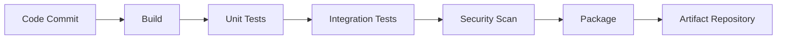
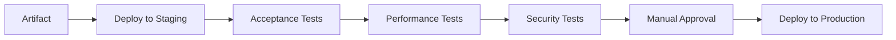
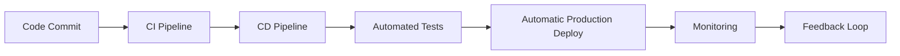

# 🔧 AWS DevOps Foundations
## Services AWS pour la Certification DevOps Engineer Professional

---

## 🎯 **AWS DevOps - Vue d'ensemble**

### **Qu'est-ce que DevOps sur AWS ?**
AWS DevOps = **Utilisation des services AWS pour implémenter les pratiques DevOps**

**AWS fournit des services natifs pour :**
- **CI/CD Pipeline** : CodeCommit, CodeBuild, CodeDeploy, CodePipeline
- **Infrastructure as Code** : CloudFormation, CDK, Systems Manager
- **Monitoring & Logging** : CloudWatch, X-Ray, CloudTrail
- **Security & Compliance** : IAM, Secrets Manager, Config
- **Container Management** : ECS, EKS, Fargate
- **Serverless** : Lambda, Step Functions, SAM

### **Avantages AWS DevOps**
```
Services Intégrés AWS             |  Solutions Tierces
• Intégration native             |  • Configuration complexe
• Scaling automatique            |  • Gestion manuelle scaling  
• Sécurité par défaut           |  • Configuration sécurité
• Pas de gestion serveur        |  • Maintenance infrastructure
• Pay-per-use                   |  • Coûts fixes élevés
```

**Résultat :** Déploiements plus rapides, plus sûrs et plus économiques

---

## ⚡ **Services AWS DevOps - Vue d'ensemble**

### **1. AWS Developer Tools (CI/CD)**
```yaml
CodeCommit:
  - Référentiel Git privé et sécurisé
  - Intégration IAM native
  - Triggers et notifications
  - Cross-region replication

CodeBuild:
  - Service de build managé
  - Support multi-environnements
  - Integration avec CodePipeline
  - Build artifacts sécurisés

CodeDeploy:
  - Automatisation des déploiements
  - Stratégies Blue/Green et Rolling
  - Rollback automatique
  - Multi-platform (EC2, Lambda, ECS)

CodePipeline:
  - Orchestration CI/CD
  - Visual workflow
  - Intégration services tiers
  - Parallel et sequential stages
```

### **2. AWS Infrastructure Services**
```yaml
CloudFormation:
  - Infrastructure as Code native AWS
  - Templates JSON/YAML
  - Stack management
  - Change sets et drift detection

CDK (Cloud Development Kit):
  - Infrastructure avec langages programmation
  - High-level constructs
  - Type safety
  - Auto-generation CloudFormation

Systems Manager:
  - Configuration management
  - Patch management
  - Parameter Store (secrets)
  - Session Manager (access)
```

### **3. AWS Monitoring & Observability**
```yaml
CloudWatch:
  - Métriques et alarmes
  - Logs centralisés
  - Dashboards
  - Events et règles

X-Ray:
  - Distributed tracing
  - Service map
  - Performance insights
  - Error analysis

CloudTrail:
  - API audit logging
  - Compliance tracking
  - Multi-region trails
  - Integration CloudWatch
```

### **4. AWS Security & Compliance**
```yaml
IAM (Identity & Access Management):
  - Rôles et politiques
  - Federation
  - Multi-factor authentication
  - Cross-account access

Secrets Manager:
  - Rotation automatique secrets
  - Integration applications
  - Audit trail
  - Cross-region replication

Config:
  - Configuration compliance
  - Rule-based evaluation
  - Remediation automatique
  - Compliance dashboard
```

---

## 🏗️ **Les 4 Piliers de DevOps**

### **1. CAMS Framework**

#### **C - Culture**
```yaml
Objectifs:
  - Collaboration entre équipes
  - Partage des responsabilités
  - Communication transparente
  - Apprentissage des échecs

Pratiques:
  - Daily standups cross-fonctionnels
  - Post-mortems blameless
  - Documentation partagée
  - Rotation d'équipes
```

#### **A - Automation**
```yaml
Objectifs:
  - Éliminer les tâches manuelles
  - Réduire les erreurs humaines
  - Accélérer les processus
  - Reproduire les environnements

Pratiques:
  - Infrastructure as Code
  - CI/CD pipelines
  - Automated testing
  - Configuration management
```

#### **M - Measurement**
```yaml
Objectifs:
  - Visibilité sur les performances
  - Décisions basées sur les données
  - Amélioration continue
  - Prédiction des problèmes

Pratiques:
  - Application monitoring
  - Infrastructure monitoring
  - Business metrics
  - Log aggregation
```

#### **S - Sharing**
```yaml
Objectifs:
  - Partage des connaissances
  - Standardisation des pratiques
  - Collaboration efficace
  - Éviter la réinvention

Pratiques:
  - Documentation collaborative
  - Code reviews
  - Knowledge sharing sessions
  - Open source contributions
```

---

## 📊 **Métriques DevOps Clés**

### **DORA Metrics (Google)**

#### **1. Lead Time for Changes**
- **Définition :** Temps entre commit et production
- **Objectif :** < 1 heure (Elite performers)
- **Mesure :** Code commit timestamp → Production deployment

#### **2. Deployment Frequency**
- **Définition :** Fréquence de déploiement en production
- **Objectif :** Plusieurs fois par jour (Elite)
- **Mesure :** Nombre de déploiements/période

#### **3. Mean Time to Recovery (MTTR)**
- **Définition :** Temps moyen de restauration après incident
- **Objectif :** < 1 heure (Elite)
- **Mesure :** Détection incident → Service restauré

#### **4. Change Failure Rate**
- **Définition :** % de déploiements causant des échecs
- **Objectif :** < 15% (Elite performers)
- **Mesure :** (Déploiements échoués / Total déploiements) × 100

### **Métriques Business**
```yaml
Performance:
  - Page load time
  - Application response time
  - Throughput (requests/second)
  - Error rates

Fiabilité:
  - Uptime/Availability (99.9%)
  - Mean Time Between Failures (MTBF)
  - Recovery Point Objective (RPO)
  - Recovery Time Objective (RTO)

Qualité:
  - Bug detection rate
  - Customer satisfaction scores
  - Security vulnerabilities
  - Technical debt ratio
```

---

## 🔄 **DevOps Lifecycle**

### **Continuous Integration (CI)**


**Pratiques CI :**
- Commits fréquents (plusieurs fois/jour)
- Build automatique à chaque commit
- Tests automatisés rapides (< 10 minutes)
- Échec rapide si problème détecté

### **Continuous Delivery (CD)**


**Pratiques CD :**
- Environnements identiques (Dev/Stage/Prod)
- Déploiements automatisés et répétables
- Configuration externalisée
- Rollback automatique si échec

### **Continuous Deployment**


---

## 🛠️ **Outils DevOps par Catégorie**

### **Source Control**
- **Git** (GitHub, GitLab, Bitbucket)
- **AWS CodeCommit**
- Branching strategies (GitFlow, GitHub Flow)

### **CI/CD**
- **Jenkins** (open source leader)
- **AWS CodePipeline + CodeBuild + CodeDeploy**
- **GitLab CI/CD**
- **GitHub Actions**
- **Azure DevOps**

### **Infrastructure as Code**
- **Terraform** (multi-cloud)
- **AWS CloudFormation** (AWS native)
- **AWS CDK** (programmatic)
- **Ansible** (configuration management)
- **Pulumi** (modern IaC)

### **Containerization**
- **Docker** (containerization)
- **Kubernetes** (orchestration)
- **AWS ECS/EKS** (managed containers)
- **AWS Fargate** (serverless containers)

### **Monitoring & Observability**
- **Prometheus + Grafana**
- **AWS CloudWatch**
- **Datadog**
- **New Relic**
- **Splunk**

---

## 🏢 **Modèles d'Organisation DevOps**

### **1. Cross-Functional Teams**
```
Team DevOps Intégrée
┌─────────────────────────┐
│ • Développeurs          │
│ • Ops Engineers         │
│ • QA Engineers          │
│ • Security Engineers    │
│ • Product Owner         │
└─────────────────────────┘
```

### **2. DevOps Team (Anti-pattern)**
```
❌ Équipe DevOps séparée
Dev Team → DevOps Team → Ops Team
(Crée un nouveau silo)
```

### **3. Platform Team**
```
✅ Platform Team
┌─────────────────┐    ┌─────────────────┐
│ Product Team A  │    │ Product Team B  │
│ (Full stack)    │    │ (Full stack)    │
└─────────────────┘    └─────────────────┘
        │                      │
        └──────────────────────┘
                │
    ┌───────────────────────┐
    │   Platform Team       │
    │ • CI/CD platforms     │
    │ • Infrastructure      │
    │ • Monitoring tools    │
    │ • Security standards  │
    └───────────────────────┘
```

---

## 🚀 **Transformation DevOps**

### **Étapes de Transformation**

#### **Phase 1 : Assessment (2-4 semaines)**
- Audit des pratiques actuelles
- Identification des pain points
- Mapping des processus existants
- Definition des objectifs SMART

#### **Phase 2 : Foundation (2-3 mois)**
- Mise en place des outils de base
- Formation des équipes
- Automatisation des processus critiques
- Établissement des métriques baseline

#### **Phase 3 : Implementation (3-6 mois)**
- Déploiement des pipelines CI/CD
- Infrastructure as Code
- Monitoring et alerting
- Culture collaborative

#### **Phase 4 : Optimization (Ongoing)**
- Amélioration continue des processus
- Optimisation des performances
- Extension à toute l'organisation
- Innovation et expérimentation

### **Challenges Communs**
- **Résistance au changement** → Communication et formation
- **Legacy systems** → Modernisation progressive
- **Skills gap** → Upskilling et recrutement
- **Tool sprawl** → Standardisation et intégration
- **Security concerns** → DevSecOps practices

---

## ✅ **Quiz DevOps Fundamentals**

### **Question 1:** Quelle est la principale différence entre Continuous Delivery et Continuous Deployment ?
<details>
<summary>Réponse</summary>
- **Continuous Delivery** : Le code est toujours prêt à être déployé, mais nécessite une approbation manuelle pour la production
- **Continuous Deployment** : Le code est automatiquement déployé en production après avoir passé tous les tests
</details>

### **Question 2:** Quelles sont les 4 métriques DORA ?
<details>
<summary>Réponse</summary>
1. **Lead Time for Changes** - Temps entre commit et production
2. **Deployment Frequency** - Fréquence de déploiement
3. **Mean Time to Recovery** - Temps de récupération après incident
4. **Change Failure Rate** - Taux d'échec des changements
</details>

### **Question 3:** Qu'est-ce qu'un "post-mortem blameless" ?
<details>
<summary>Réponse</summary>
Une analyse d'incident qui se concentre sur :
- **What happened** (facts)
- **Why it happened** (root causes)
- **How to prevent it** (improvements)
Sans chercher de coupable, mais en apprenant de l'incident pour améliorer le système.
</details>

### **Question 4:** Expliquez le concept "Shift Left" en DevOps.
<details>
<summary>Réponse</summary>
**Shift Left** signifie déplacer les activités (tests, sécurité, qualité) plus tôt dans le cycle de développement :
- Tests dès le développement (pas seulement avant production)
- Sécurité intégrée dans le code (DevSecOps)
- Feedback rapide aux développeurs
- **Avantage** : Détection précoce = correction moins coûteuse
</details>

---

## 🎯 **Points Clés pour la Certification**

### **AWS DevOps Focus**
- DevOps n'est **PAS** juste des outils, c'est une **culture**
- L'**automation** est essentielle pour la scalabilité
- **Monitoring** et **feedback loops** sont critiques
- **Security** doit être intégrée (DevSecOps)
- **Infrastructure as Code** pour la reproductibilité
- **CI/CD** pipelines pour la rapidité et qualité

### **Best Practices AWS**
- Utilisez les **AWS native tools** quand possible
- **Multi-region** pour la haute disponibilité
- **Least privilege** pour la sécurité
- **Automation** over manual processes
- **Monitoring** et **logging** comprehensive
- **Cost optimization** continuous

---

**🎯 Next: Git et Version Control Avancé pour DevOps →**
