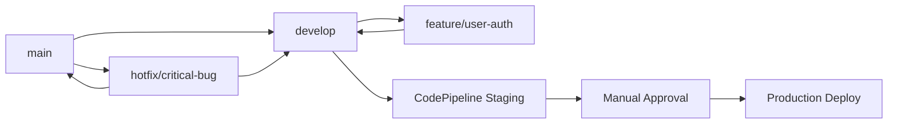

# 🏗️ AWS CodeCommit - Git Repository Service
## Source Control pour AWS DevOps Pipeline

---

## 🎯 **AWS CodeCommit Overview**

### **Qu'est-ce que CodeCommit ?**
**AWS CodeCommit** est un service de contrôle de version Git entièrement managé qui :
- Héberge des référentiels Git privés et sécurisés
- S'intègre nativement avec les services AWS
- Offre une haute disponibilité et durabilité
- Pas de limite sur la taille des référentiels
- Chiffrement en transit et au repos

### **Pourquoi CodeCommit vs GitHub/GitLab ?**
```yaml
AWS CodeCommit:
  ✅ Intégration native AWS (IAM, CloudTrail)
  ✅ Pas de serveur à gérer
  ✅ Scaling automatique
  ✅ Sécurité AWS par défaut
  ✅ Pas de coût par développeur
  ❌ Fonctionnalités limitées vs GitHub
  ❌ Pas de communauté open source

GitHub/GitLab:
  ✅ Riche écosystème et features
  ✅ Community et open source
  ✅ Advanced CI/CD features
  ❌ Coût par utilisateur
  ❌ Configuration complexe avec AWS
  ❌ Gestion sécurité supplémentaire
```

---

## 🔧 **Configuration et Setup CodeCommit**

### **Créer un Repository CodeCommit**

#### **Via AWS CLI**
```bash
# Créer un repository
aws codecommit create-repository \
    --repository-name my-devops-app \
    --repository-description "Application DevOps avec CI/CD"

# Obtenir l'URL de clonage
aws codecommit get-repository \
    --repository-name my-devops-app \
    --query 'repositoryMetadata.cloneUrlHttp'
```

#### **Via CloudFormation**
```yaml
AWSTemplateFormatVersion: '2010-09-09'
Description: 'CodeCommit Repository for DevOps Pipeline'

Resources:
  DevOpsRepository:
    Type: AWS::CodeCommit::Repository
    Properties:
      RepositoryName: my-devops-app
      RepositoryDescription: "Application DevOps avec CI/CD pipeline"
      Code:
        S3:
          Bucket: !Ref CodeBucket
          Key: initial-code.zip
      Triggers:
        - Name: MainBranchTrigger
          DestinationArn: !GetAtt PipelineTrigger.Arn
          Events:
            - pushToRepository
          Branches:
            - main

  # SNS Topic pour notifications
  PipelineTrigger:
    Type: AWS::SNS::Topic
    Properties:
      TopicName: codecommit-pipeline-trigger
      
Outputs:
  RepositoryCloneUrl:
    Description: "URL de clonage du repository"
    Value: !GetAtt DevOpsRepository.CloneUrlHttp
    Export:
      Name: !Sub "${AWS::StackName}-repo-url"
```

### **Configuration d'Accès**

#### **1. HTTPS avec Git Credentials**
```bash
# Configurer les credentials Git
aws iam create-service-specific-credential \
    --user-name developer \
    --service-name codecommit.amazonaws.com

# Cloner le repository
git clone https://git-codecommit.us-east-1.amazonaws.com/v1/repos/my-devops-app
```

#### **2. SSH avec Clés**
```bash
# Générer une clé SSH
ssh-keygen -t rsa -b 4096 -f ~/.ssh/codecommit_key

# Uploader la clé publique
aws iam upload-ssh-public-key \
    --user-name developer \
    --ssh-public-key-body file://~/.ssh/codecommit_key.pub

# Configuration SSH (~/.ssh/config)
Host git-codecommit.*.amazonaws.com
  User APKAEIBAERJR2EXAMPLE  # SSH Key ID
  IdentityFile ~/.ssh/codecommit_key
  StrictHostKeyChecking no

# Cloner avec SSH
git clone ssh://git-codecommit.us-east-1.amazonaws.com/v1/repos/my-devops-app
```

#### **3. IAM Roles pour EC2/Lambda**
```json
{
  "Version": "2012-10-17",
  "Statement": [
    {
      "Effect": "Allow",
      "Action": [
        "codecommit:GitPull",
        "codecommit:GitPush",
        "codecommit:ListBranches",
        "codecommit:ListRepositories"
      ],
      "Resource": "arn:aws:codecommit:us-east-1:123456789012:my-devops-app"
    }
  ]
}
```

---

## 🌿 **Branch Management avec CodeCommit**

### **Branch Protection Rules**

#### **Via CloudFormation**
```yaml
BranchProtectionRule:
  Type: AWS::CodeCommit::Repository
  Properties:
    RepositoryName: my-devops-app
    Code:
      BranchDefaultName: main
    RepositoryPolicyDocument:
      Version: '2012-10-17'
      Statement:
        - Sid: RequireSignedCommits
          Effect: Deny
          Principal: "*"
          Action: codecommit:GitPush
          Resource: "*"
          Condition:
            Bool:
              "codecommit:git-push-signed": "false"
```

### **Branching Strategy pour AWS DevOps**

#### **Recommended: Simplified GitFlow pour AWS**


**Structure recommandée :**
- **main** : Production code (protégée)
- **develop** : Integration branch (trigger staging)
- **feature/** : Feature development
- **hotfix/** : Critical production fixes

#### **Workflow avec CodePipeline**
```yaml
# Pipeline triggered on branch push
PipelineSourceStage:
  Type: AWS::CodePipeline::Pipeline
  Properties:
    Stages:
      - Name: Source
        Actions:
          - Name: SourceAction
            ActionTypeId:
              Category: Source
              Owner: AWS
              Provider: CodeCommit
              Version: 1
            Configuration:
              RepositoryName: my-devops-app
              BranchName: !Ref BranchName
              PollForSourceChanges: false  # Use CloudWatch Events
            OutputArtifacts:
              - Name: SourceOutput
```

---

## 🔔 **Triggers et Notifications**

### **CloudWatch Events Integration**

#### **Trigger Pipeline on Push**
```yaml
CodeCommitEventRule:
  Type: AWS::Events::Rule
  Properties:
    Description: "Trigger pipeline on CodeCommit push"
    EventPattern:
      source:
        - aws.codecommit
      detail-type:
        - CodeCommit Repository State Change
      detail:
        event:
          - pushToRepository
        repositoryName:
          - !Ref RepositoryName
        referenceName:
          - refs/heads/main
          - refs/heads/develop
    Targets:
      - Arn: !Sub "arn:aws:codepipeline:${AWS::Region}:${AWS::AccountId}:pipeline/${PipelineName}"
        Id: "CodeCommitPipelineTrigger"
        RoleArn: !GetAtt EventsRole.Arn
```

#### **Lambda Function pour Custom Actions**
```python
import json
import boto3

def lambda_handler(event, context):
    """
    Triggered sur CodeCommit push
    Peut exécuter des actions custom (notifications, validations)
    """
    
    # Parse l'événement CodeCommit
    detail = event['detail']
    repository_name = detail['repositoryName']
    branch = detail['referenceName'].split('/')[-1]
    commit_id = detail['commitId']
    
    print(f"Push détecté sur {repository_name}, branch {branch}, commit {commit_id}")
    
    # Actions custom
    if branch == 'main':
        # Notification pour push en production
        send_slack_notification(f"🚀 Push to production: {commit_id}")
        
    elif branch.startswith('feature/'):
        # Déclencher tests automatiques
        trigger_feature_tests(repository_name, commit_id)
    
    return {
        'statusCode': 200,
        'body': json.dumps('Event processed successfully')
    }

def send_slack_notification(message):
    # Implementation Slack webhook
    pass

def trigger_feature_tests(repo, commit):
    # Déclencher CodeBuild pour tests
    codebuild = boto3.client('codebuild')
    codebuild.start_build(
        projectName='feature-tests',
        sourceVersion=commit
    )
```

### **Pull Request Automation**

#### **Approval Rules avec Lambda**
```python
import boto3

def lambda_handler(event, context):
    """
    Auto-approval pour certaines conditions
    """
    codecommit = boto3.client('codecommit')
    
    # Récupérer les détails du PR
    pull_request_id = event['detail']['pullRequestId']
    repository_name = event['detail']['repositoryName']
    
    # Vérifier les conditions d'auto-approval
    pr_details = codecommit.get_pull_request(
        pullRequestId=pull_request_id
    )
    
    # Auto-approve si :
    # - Changements documentation uniquement
    # - Auteur est un senior developer
    # - Tests passent automatiquement
    
    if should_auto_approve(pr_details):
        codecommit.update_pull_request_approval_state(
            pullRequestId=pull_request_id,
            approvalState='APPROVE'
        )
        
        # Merge automatique
        codecommit.merge_pull_request_by_fast_forward(
            pullRequestId=pull_request_id,
            repositoryName=repository_name
        )
```

---

## 🔒 **Sécurité CodeCommit**

### **IAM Policies Granulaires**

#### **Policy par Environment**
```json
{
  "Version": "2012-10-17",
  "Statement": [
    {
      "Sid": "DeveloperAccess",
      "Effect": "Allow",
      "Action": [
        "codecommit:GitPull",
        "codecommit:GitPush",
        "codecommit:CreateBranch",
        "codecommit:CreatePullRequest"
      ],
      "Resource": "*",
      "Condition": {
        "StringLike": {
          "codecommit:References": [
            "refs/heads/feature/*",
            "refs/heads/develop"
          ]
        }
      }
    },
    {
      "Sid": "MainBranchRestricted",
      "Effect": "Deny",
      "Action": [
        "codecommit:GitPush",
        "codecommit:DeleteBranch",
        "codecommit:MergePullRequestByFastForward"
      ],
      "Resource": "*",
      "Condition": {
        "StringEquals": {
          "codecommit:References": "refs/heads/main"
        }
      }
    }
  ]
}
```

#### **Cross-Account Access**
```json
{
  "Version": "2012-10-17",
  "Statement": [
    {
      "Sid": "CrossAccountAccess",
      "Effect": "Allow",
      "Principal": {
        "AWS": "arn:aws:iam::STAGING-ACCOUNT:root"
      },
      "Action": [
        "codecommit:GitPull",
        "codecommit:ListBranches"
      ],
      "Resource": "*"
    }
  ]
}
```

### **Encryption et Compliance**

#### **KMS Encryption**
```yaml
EncryptedRepository:
  Type: AWS::CodeCommit::Repository
  Properties:
    RepositoryName: secure-app
    KmsKeyId: !Ref CodeCommitKMSKey

CodeCommitKMSKey:
  Type: AWS::KMS::Key
  Properties:
    Description: "KMS Key for CodeCommit encryption"
    KeyPolicy:
      Version: '2012-10-17'
      Statement:
        - Sid: Enable IAM User Permissions
          Effect: Allow
          Principal:
            AWS: !Sub 'arn:aws:iam::${AWS::AccountId}:root'
          Action: 'kms:*'
          Resource: '*'
        - Sid: Allow CodeCommit
          Effect: Allow
          Principal:
            Service: codecommit.amazonaws.com
          Action:
            - kms:Decrypt
            - kms:GenerateDataKey
          Resource: '*'
```

---

## 📊 **Monitoring et Metrics CodeCommit**

### **CloudWatch Metrics**

#### **Key Metrics à Monitorer**
```yaml
Repository Metrics:
  - NumberOfPushes: Activité développement
  - NumberOfPullRequests: Collaboration équipe
  - RepositorySize: Croissance du code
  - NumberOfBranches: Gestion branches

Performance Metrics:
  - CloneTime: Performance accès
  - PushTime: Performance upload
  - ApiCallLatency: Réactivité API

Security Metrics:
  - FailedAuthenticationAttempts: Tentatives accès
  - UnauthorizedApiCalls: Actions non autorisées
```

#### **Custom Metrics avec Lambda**
```python
import boto3
import json
from datetime import datetime, timedelta

def lambda_handler(event, context):
    """
    Génère des métriques custom pour CodeCommit
    """
    cloudwatch = boto3.client('cloudwatch')
    codecommit = boto3.client('codecommit')
    
    # Métriques par repository
    repositories = codecommit.list_repositories()['repositories']
    
    for repo in repositories:
        repo_name = repo['repositoryName']
        
        # Compter les commits dernières 24h
        commits = get_commits_last_24h(repo_name)
        
        # Publier métrique custom
        cloudwatch.put_metric_data(
            Namespace='AWS/CodeCommit/Custom',
            MetricData=[
                {
                    'MetricName': 'CommitsLast24Hours',
                    'Dimensions': [
                        {
                            'Name': 'Repository',
                            'Value': repo_name
                        }
                    ],
                    'Value': len(commits),
                    'Unit': 'Count'
                }
            ]
        )

def get_commits_last_24h(repository_name):
    codecommit = boto3.client('codecommit')
    
    # Récupérer commits dernières 24h
    yesterday = datetime.now() - timedelta(days=1)
    
    response = codecommit.get_commit_history(
        repositoryName=repository_name,
        since=yesterday.isoformat()
    )
    
    return response.get('commits', [])
```

### **CloudTrail Auditing**

#### **Audit Trail Configuration**
```yaml
CodeCommitAuditTrail:
  Type: AWS::CloudTrail::Trail
  Properties:
    TrailName: codecommit-audit-trail
    S3BucketName: !Ref AuditBucket
    IncludeGlobalServiceEvents: true
    IsMultiRegionTrail: true
    EnableLogFileValidation: true
    EventSelectors:
      - ReadWriteType: All
        IncludeManagementEvents: true
        DataResources:
          - Type: "AWS::CodeCommit::Repository"
            Values:
              - "arn:aws:codecommit:*:*:*"
```

---

## ✅ **Quiz AWS CodeCommit**

### **Question 1:** Quelle est la différence entre CodeCommit triggers et CloudWatch Events ?
<details>
<summary>Réponse</summary>

**CodeCommit Triggers :**
- Configuration directe sur le repository
- Limités aux actions SNS et Lambda
- Configuration simple mais moins flexible

**CloudWatch Events :**
- Plus de flexibilité (multiples targets)
- Pattern matching avancé
- Intégration avec plus de services AWS
- **Recommandé pour CI/CD pipelines**

**Exemple pattern CloudWatch :**
```json
{
  "source": ["aws.codecommit"],
  "detail-type": ["CodeCommit Repository State Change"],
  "detail": {
    "referenceName": ["refs/heads/main"]
  }
}
```
</details>

### **Question 2:** Comment implémenter le branch protection dans CodeCommit ?
<details>
<summary>Réponse</summary>

**CodeCommit n'a pas de branch protection native**, mais on peut :

1. **IAM Policies** pour restreindre l'accès
2. **Approval Rules** pour Pull Requests
3. **Lambda Hooks** pour validation custom

**Exemple IAM Policy :**
```json
{
  "Effect": "Deny",
  "Action": "codecommit:GitPush",
  "Resource": "*",
  "Condition": {
    "StringEquals": {
      "codecommit:References": "refs/heads/main"
    },
    "Null": {
      "codecommit:git-push-signed": "true"
    }
  }
}
```
</details>

### **Question 3:** Comment migrer de GitHub vers CodeCommit ?
<details>
<summary>Réponse</summary>

**Étapes de Migration :**

1. **Créer repository CodeCommit**
2. **Clone GitHub repository**
3. **Add CodeCommit remote**
4. **Push all branches**

```bash
# Clone du repo GitHub
git clone https://github.com/user/repo.git
cd repo

# Ajouter remote CodeCommit
git remote add codecommit https://git-codecommit.us-east-1.amazonaws.com/v1/repos/repo

# Push toutes les branches
git push codecommit --all
git push codecommit --tags

# Mettre à jour CI/CD pipelines
# Configurer les webhooks
# Former les équipes
```

**Considerations :**
- Issues et PRs ne migrent pas automatiquement
- Reconfigurer les intégrations (CI/CD, webhooks)
- Formation équipes sur AWS tooling
</details>

### **Question 4:** Comment optimiser les coûts CodeCommit ?
<details>
<summary>Réponse</summary>

**CodeCommit Pricing :**
- **5 utilisateurs actifs gratuits par mois**
- **50 GB-month de stockage gratuit**
- **10,000 requests gratuits par mois**

**Stratégies d'optimisation :**

1. **Nettoyage régulier** des branches feature
2. **Git LFS** pour gros fichiers binaires
3. **Repository archiving** pour anciens projets
4. **Monitoring usage** avec CloudWatch
5. **Multi-account strategy** pour séparer les coûts

```bash
# Nettoyer les branches mergées
git branch --merged main | grep -v main | xargs -n 1 git branch -d

# Optimiser la taille du repo
git gc --aggressive --prune=now
```
</details>

---

## 🎯 **Points Clés pour Certification AWS**

### **CodeCommit Key Features**
- **Fully managed** Git service
- **High availability** (99.99% SLA)
- **Integration** with AWS services (IAM, CloudTrail, CloudWatch)
- **Encryption** in transit and at rest
- **No repository size limits**
- **Cross-region replication** possible

### **Best Practices AWS**
- Use **IAM roles** over Git credentials when possible
- Implement **least privilege** access
- Enable **CloudTrail** for auditing
- Use **CloudWatch Events** for pipeline triggers
- Configure **approval rules** for critical branches
- Implement **automated testing** with CodeBuild

### **Integration Patterns**
- **CodeCommit → CodeBuild → CodeDeploy → CodePipeline**
- **Multi-account** deployment patterns
- **Cross-region** disaster recovery
- **Hybrid** with on-premises Git (AWS Direct Connect)

---

**🎯 Next: AWS CodeBuild - Build Automation Service →**
